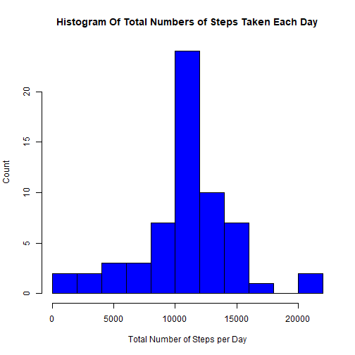

## Introduction
It is now possible to collect a large amount of data about personal movement using activity monitoring devices such as a Fitbit , Nike Fuelband, or Jawbone Up. These type of devices are part of the "quantified self" movement - a group of enthusiasts who take measurements about themselves regularly to improve their health, to find patterns in their behavior, or because they are tech geeks. But these data remain underutilized both because the raw data are hard to obtain and there is a lack of statistical methods and software for processing and interpreting the data.

##Loading and preprocessing the data

This assignment makes use of data from a personal activity monitoring device. This device collects data at 5 minute intervals through out the day. The data consists of two months of data from an anonymous individual collected during the months of October and November, 2012 and include the number of steps taken in 5 minute intervals each day.

The data is a comma delimited file, it includes 17,568 observations of 3 variables:

 * steps: Number of steps taken in a 5 min interval
 * date: The date when the measurement was taken in YYY-MM-DD format
 * interval: Identifier for the 5-min interval in which the measurement was taken
 
 1. Reading the data from "activity.csv"


```r
activity <- read.csv( "activity.csv",header = T, sep = ",", na.strings = "NA")
```


```r
#Looking at the data using summary and str functions
summary(activity)
```

```
##      steps                date          interval     
##  Min.   :  0.00   2012-10-01:  288   Min.   :   0.0  
##  1st Qu.:  0.00   2012-10-02:  288   1st Qu.: 588.8  
##  Median :  0.00   2012-10-03:  288   Median :1177.5  
##  Mean   : 37.38   2012-10-04:  288   Mean   :1177.5  
##  3rd Qu.: 12.00   2012-10-05:  288   3rd Qu.:1766.2  
##  Max.   :806.00   2012-10-06:  288   Max.   :2355.0  
##  NA's   :2304     (Other)   :15840
```

```r
str(activity)
```

```
## 'data.frame':	17568 obs. of  3 variables:
##  $ steps   : int  NA NA NA NA NA NA NA NA NA NA ...
##  $ date    : Factor w/ 61 levels "2012-10-01","2012-10-02",..: 1 1 1 1 1 1 1 1 1 1 ...
##  $ interval: int  0 5 10 15 20 25 30 35 40 45 ...
```


```r
#Convert the "data" varibale to a Data class and interval as a "factor"
activity$date <- as.Date(activity$date, format= "%Y-%m-%d")
activity$interval <- factor(activity$interval)
str(activity)
```

```
## 'data.frame':	17568 obs. of  3 variables:
##  $ steps   : int  NA NA NA NA NA NA NA NA NA NA ...
##  $ date    : Date, format: "2012-10-01" "2012-10-01" ...
##  $ interval: Factor w/ 288 levels "0","5","10","15",..: 1 2 3 4 5 6 7 8 9 10 ...
```

```r
# Filter NA out of the data
Na_data <- !is.na(activity$steps)

#Apply filter to date and step
filter_steps <- activity$steps[Na_data]
filter_date <- activity$date[Na_data]
```

## What is the histogram of the steps taken each day?

2. Histogram of the total number of steps taken each day

```r
daily.steps <- rowsum(filter_steps, filter_date)
hist(daily.steps, breaks = 10,
     col = "red",
     xlab= "Total Number of Steps per Day",
     ylab = "Count",
     main = "Histogram Of Total Numbers of Steps Taken Each Day"
     )
```


3. Mean and median number of steps taken each day

```r
mean(daily.steps)
```

```
## [1] 10766.19
```

```r
median(daily.steps)
```

```
## [1] 10765
```

## What is the average daily activity?

4. Time series plot of the average number of steps taken


```r
#Calculating the average steo
steps_interval <- aggregate(filter_steps,by=list(activity$interval[Na_data]), FUN=mean)
#Rename the column names
colnames(steps_interval) <- c("interval", "average_steps")
#Plotting the average daily activity
plot(as.integer(levels(steps_interval$interval)),
     steps_interval$average_steps, 
     type="l",
     xlab = "Interval", 
     ylab = "Average Number of Steps",
     main = "Average Daily Activity Pattern",
     col ="blue"
     )
```


5. The 5-minute interval that, on average, contains the maximum number of steps


```r
# The max average number of steps
max(steps_interval$average_steps)
```

```
## [1] 206.1698
```

```r
#The 5-minute interval that, on  average, contains the maximum number of steps
steps_interval$interval[which.max(steps_interval$average_steps)]
```

```
## [1] 835
## 288 Levels: 0 5 10 15 20 25 30 35 40 45 50 55 100 105 110 115 120 ... 2355
```
## Imputting Missing Data
6. Strategy for imputing missing data

```r
# How many NA's in each column of data
colSums(is.na(activity))
```

```
##    steps     date interval 
##     2304        0        0
```
So the total of missing values is in the "steps" column with **2304**.

##Fill in the indecies with the Average Number


```r
#Create a new activity that has "NA's" replaced
new_activity <- activity

# We loop through the new_activty and see if the values are NA. When the condition is TRUE, we search throught the corrosponding steps_interval (index) and extract a temporary value. This is done by using *for* loop. 

for (i in 1:nrow(new_activity)) {
      if (is.na(new_activity$steps[i])) {
            index <- new_activity$interval[i]
            value <- subset(steps_interval, interval==index)
            new_activity$steps[i] <- value$average_steps
      }
}
head(new_activity)
```

```
##       steps       date interval
## 1 1.7169811 2012-10-01        0
## 2 0.3396226 2012-10-01        5
## 3 0.1320755 2012-10-01       10
## 4 0.1509434 2012-10-01       15
## 5 0.0754717 2012-10-01       20
## 6 2.0943396 2012-10-01       25
```

We can see that the values have been filled. 

## Histogram of total numbers of steps taken each day with missing values imputed

7.Histogram of the total number of steps taken each day after missing values are imputed


```r
daily.steps.complete <- rowsum(new_activity$steps, new_activity$date)
hist(daily.steps.complete, breaks = 10,
     col = "blue",
     xlab= "Total Number of Steps per Day",
     ylab = "Count",
     main = "Histogram Of Total Numbers of Steps Taken Each Day"
     )
```




```r
mean(daily.steps.complete)
```

```
## [1] 10766.19
```

```r
median(daily.steps.complete)
```

```
## [1] 10766.19
```
The mean and the median dataset are equal in both cases. The data input didn't make much of a difference. 

## Are there differences in activity patterns between weekdays and weekends?

8. Panel plot comparing the average number of steps taken per 5-minute interval across weekdays and weekends


```r
#Creat a new data set with two levels - Weekend and Weekday

new_activity$day <- ifelse(as.POSIXlt(as.Date(new_activity$date))$wday%%6 == 
                                    0, "weekend", "weekday")
new_activity$day <- factor(new_activity$day, levels = c("weekday", "weekend"))
```

Make a panel plot containing a time series plot (i.e. type = "l") of the 5-minute interval (x-axis) and the average number of steps taken, averaged across all weekday days or weekend days (y-axis).


```r
steps.interval= aggregate(steps ~ interval + day, new_activity, mean)
library(lattice)
xyplot(steps ~ interval | factor(day), data = steps.interval, layout = c(1,2),
       type = "l")
```


